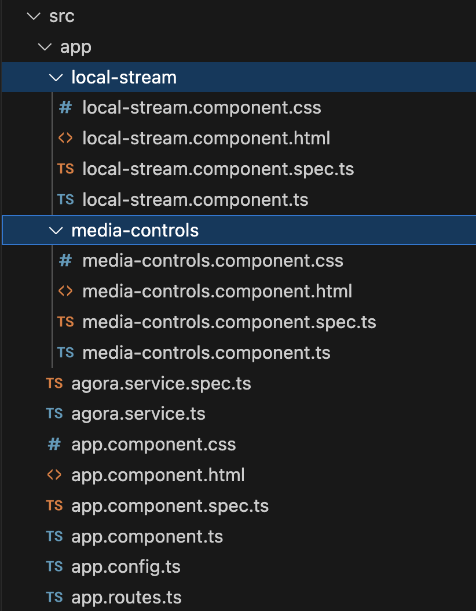
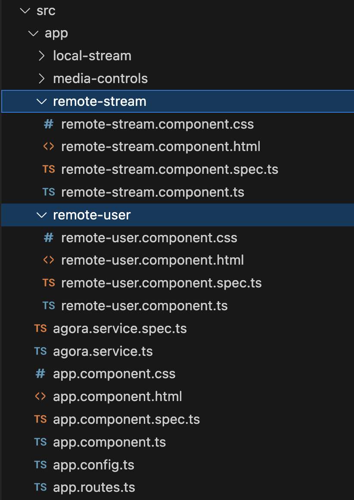

# Integrate Agora Video SDK into an Angular Project

## Prerequisites 
- [Node.JS](https://nodejs.org)
- [Angular CLI](https://angular.io/cli) (`npm install -g @angular/cli `)
- A developer account with [Agora.io](https://console.agora.io)
- A basic understanding of HTML/CSS/JS
- A code editor, I like to use [VSCode](https://code.visualstudio.com)

## Project Setup

   1. Create a new project (replace `agora-angular-demo` with your project name)

      ```bash
      ng new agora-angular-demo
      ```

   1. Navigate to the project directory using 

      ```bash
      cd agora-angular-demo
      ```

   1. Install the Agora Video SDK for Web

      ```bash
      npm i agora-rtc-sdk-ng
      ```  

## Integrate Agora Video SDK
The Agora SDK has three core elements, the Agora RTC Engine, the Local user, and the remote users. To integrate these elemnts with Angular we'll setup the Agora RTC Engine as a service in our project and we'll break the local user and remote users into their own components.

  ### Agora Service
   1. To create the Agora Service, use the command 

      ```bash
      ng generate service agora
      ```

   1. Configure the Agora Service
   Open the [`agora.service.ts`](/src/app/agora.service.ts) file and import the Agora Video Web SDK. First we'll setup the variables for this service. The `client` represents the Agora RTC Client (used for joining and leaving channels), the Agora AppId for your project (get this from the [Agora Console](https://console.agora.io)) which is loaded from the environment variable, and lastly we'll set up an observable `channelJoined$` to let other components subscribe to the join and leave events. The Agora Service exposes 3 core functions, `joinChannel` and `leaveChannel` for joing and leaving Agora channels, along with a function to setupLocalTracks which initializes the mic and camera streams.

      ```ts
      /* agora.service.ts */
      import { Injectable } from '@angular/core';
      import AgoraRTC, { ILocalTrack, IAgoraRTCClient } from 'agora-rtc-sdk-ng';
      import { environment } from '../environments/environments';
      import { BehaviorSubject } from 'rxjs';

      @Injectable({
        providedIn: 'root'
      })
      export class AgoraService {
        private client: IAgoraRTCClient;
        private appId = environment.AgoraAppId

        private channelJoinedSource = new BehaviorSubject<boolean>(false);
        channelJoined$ = this.channelJoinedSource.asObservable();

        constructor() { 
          if(this.appId == '')
            console.error('APPID REQUIRED -- Open AgoraService.ts and update appId ')
          this.client = AgoraRTC.createClient({ mode: 'rtc', codec: 'vp9'})
        }

        async joinChannel(channelName: string, token: string | null, uid: string | null) {
          await this.client.join(this.appId, channelName, token, uid)
          this.channelJoinedSource.next(true)
        }

        async leaveChannel() {
          await this.client.leave()
          this.channelJoinedSource.next(false)
        }

        setupLocalTracks(): Promise<ILocalTrack[]> {
          return AgoraRTC.createMicrophoneAndCameraTracks();
        }

        getClient() {
          return this.client
        }

      }
      ```
  ### Local and Remote User Components
  Now that we have our Agora Service setup we need to create components for our local and remote users. We'll need to create a few components to compartmentalize the elements: 
  - **Local user** will be made up of two components, the [`local-stream`](/src/app/local-stream/) as the main component that interacts with the Agora Service and a nested component [`media-controls`](/src/app/media-controls/) to hold the buttons that handle passing the user actions *(mute mic/video or leave channel)* back to the `local-stream`. 
  
  - **Remote users** will similarly be made up of a main component [`remote-stream`](/src/app/remote-stream/), which is the container for all remote user div elements, and a seperate component [`remote-user`](/src/app/remote-user/) which represents the individual remote-users. These components will be dynamically added/removed from container everytime a remote user publishes/unpublishes their audio/video streams.

  ### Local User Components 
  To create the local user components, use the commands 

  ```bash
  ng generate component local-stream
  ng generate component media-controls
  ```

  This will create the following directories see the following directories and their respective files (html,css, ts):

  

   1. We'll start with the HMTL, open the [`local-stream.component.html`](/src/app/local-stream/local-stream.component.html) and replace the placeholder tags with:

      ```html
      <div id="local-video-container">
        <app-media-controls></app-media-controls>
        <div #localVideo id="local-video"></div>
      </div>
      ```  

   1. Next open the [`local-stream.component.ts`](/src/app/local-stream/local-stream.component.ts). First, import the `MediaControlsComponent` so it gets loaded into this component. Then, add a reference to the `#localVideo` so the Agora SDK to play the video in that `<div/>`. We'll need add an `EventEmitter` to emit an event when the user has left the channel. The next variable we'll declare are for the `client` which will come from the [`AgoraService`](/src/app/agora.service.ts), then we'll add a set of references to our local tracks (mic, video, and screen) along with `localTracksActive` to flag the mute-state of each track, and lastly we'll set a subscription and a flag to keep track of when the [`AgoraService`](/src/app/agora.service.ts) has joined a channel.

      When the view inits for this component it triggers the local `client` to use the Agora SDK to initialize the local `mic` and `camera` tracks, and sets a listener to publish them once we join the channel. When the user leaves the channel the app will remove the view and this will trigger the `handleLeave()` which unpublishes and closes up all the tracks to release the mic and camera resources. 

      In the `muteTrack()` we use `setEnabled()` instead of `setMuted()`. While the effect is very similar for the remote users, the experience differs for the local users because `setEnabled()` releases the mic/camera resources giving the users a clear indication that their mic or camera as not active.

      ```ts
      import { AfterViewInit, Component, ElementRef, EventEmitter, Output, ViewChild } from '@angular/core'
      import { ILocalTrack, IAgoraRTCClient } from 'agora-rtc-sdk-ng';
      import { AgoraService } from '../agora.service';
      import { MediaControlsComponent } from '../media-controls/media-controls.component';
      import { Subscription } from 'rxjs';

      @Component({
        selector: 'app-local-stream',
        standalone: true,
        imports: [MediaControlsComponent],
        templateUrl: './local-stream.component.html',
        styleUrl: './local-stream.component.css'
      })
      export class LocalStreamComponent implements AfterViewInit {
        @ViewChild('localVideo', { static: true }) localVideo!: ElementRef<HTMLDivElement>;
        @Output() leaveChannel = new EventEmitter<void>();

        private client: IAgoraRTCClient;

        private localMicTrack!: ILocalTrack;
        private localVideoTrack!: ILocalTrack;
        private localScreenTracks?: ILocalTrack[];

        private channelJoined: boolean = false;
        private subscription: Subscription = new Subscription();

        private localTracksActive = {
          audio: false,
          video: false,
          screen: false,
        }

        // Mapping to simplify getting/setting track-state
        private trackNameMapping: { [key:string]: 'audio' | 'video' | 'screen' } = {
          audio: 'audio',
          video: 'video',
          screen: 'screen',
        }

        constructor(private agoraService: AgoraService) {
          this.client = this.agoraService.getClient()
        }

        async ngAfterViewInit(): Promise<void> {
          [this.localMicTrack, this.localVideoTrack] = await this.agoraService.setupLocalTracks();
          this.localTracksActive.audio = this.localMicTrack ? true : false
          this.localTracksActive.video = this.localVideoTrack ? true : false
          // play video track in localStreamComponent div
          this.localVideoTrack.play(this.localVideo.nativeElement);
          this.subscription.add(this.agoraService.channelJoined$.subscribe(status => {
            this.channelJoined = status
            if(status) {
              this.publishTracks() // publish the tracks once we are in the channel
            }
          }))
        }

        async ngOnDestroy() {
          // leave the channel if the component unmounts
          this.handleLeaveChannel()
        }

        async publishTracks() {
          await this.client.publish([ this.localMicTrack, this.localVideoTrack ])
        }

        async unpublishTracks() {
          await this.client.publish([ this.localMicTrack, this.localVideoTrack ])
        }

        async handleLeaveChannel(): Promise<void> {
          if(this.channelJoined) {
            const tracks = [this.localMicTrack, this.localVideoTrack]
            tracks.forEach(track => {
              track.close()
            })
            await this.client.unpublish(tracks)
            await this.agoraService.leaveChannel()
          }
          this.leaveChannel.emit()
        }

        async muteTrack(trackName: string, enabled: boolean): Promise<boolean> {
          const track = trackName === 'mic' ? this.localMicTrack : this.localVideoTrack;
          await track.setEnabled(enabled);
          this.setTrackState(trackName, enabled)
          return enabled;
        }

        async startScreenShare(): Promise<boolean> {
          // TODO: add start screen share
          // Listen for screen share ended event (from browser ui button)
          // this.localScreenTracks[0]?.on("track-ended", () => {
          //   this.stopScreenShare()
          // })    
          return true;
        }

        async stopScreenShare(): Promise<boolean> {
          // TODO: add stop screenshare
          return false;
        }

        getTrackState(trackName: string): boolean | undefined {
          const key = this.trackNameMapping[trackName]
          if (key) {
            return this.localTracksActive[key]
          }
          console.log(`Get Track State Error: Unknown trackName: ${trackName}`)
          return
        }

        setTrackState(trackName: string, state: boolean): void {
          const key = this.trackNameMapping[trackName]
          if (key) {
            this.localTracksActive[key] = state
          }
          console.log(`Set Track State Error: Unknown trackName: ${trackName}`)
          return
        }

      }

      ```  
  1. Moving on to the `media-controls` component, again we'll start with the HMTL, open the [`media-controls.component.html`](/src/app/media-controls/media-controls.component.html) and replace the placeholder tags with:

     ```html
     <div id="local-media-controls">
       <button #micButton (click)="handleMicToggle($event)" class="media-active">Mic</button>
       <button #videoButton (click)="handleVideoToggle($event)" class="media-active">Video</button>
       <button #screenShareButton (click)="handleScreenShare($event)" class="media-active">Screen</button>
       <button #leaveButton (click)="handleLeaveChannel()" class="media-active">End</button>
     </div>
     ```  

     The structure is simple, a container and a set of buttons. Each button has it's own click event that we'll define in [`media-controls.component.ts`](/src/app/media-controls/media-controls.component.ts). 

  1. Next open the [`media-controls.component.ts`](/src/app/media-controls/media-controls.component.ts). This component is meant to be fairly light and it uses the `LocalStreamComponent` to mute and unmute the mic and camera, to start and stop Screen Sharing, and to leave the channel. The button states are updated using the classes `media-active` and `muted`. 
     ```ts
     import { Component, ElementRef, ViewChild } from '@angular/core'
     import { LocalStreamComponent } from '../local-stream/local-stream.component';

      @Component({
        selector: 'app-media-controls',
        standalone: true,
        imports: [],
        templateUrl: './media-controls.component.html',
        styleUrl: './media-controls.component.css'
      })
      export class MediaControlsComponent {
        // Buttons
        @ViewChild('micButton', { static: true }) micButton!: ElementRef<HTMLButtonElement>;
        @ViewChild('videoButton', { static: true }) videoButton!: ElementRef<HTMLButtonElement>;
        @ViewChild('screenShareButton', { static: true }) screenShareButton!: ElementRef<HTMLButtonElement>;
        @ViewChild('leaveButton', { static: true }) leaveButton!: ElementRef<HTMLButtonElement>;

        constructor (private localStream: LocalStreamComponent) {}

        handleMicToggle(e: Event): void {
          const isActive = this.localStream.getTrackState('mic') // get active state
          this.localStream.muteTrack('mic', !isActive)
          this.toggleButtonActiveState(e.target as HTMLDivElement)
        }

        handleVideoToggle(e: Event): void {
          const isActive = this.localStream.getTrackState('video') ?? false// get active state
          this.localStream.muteTrack('video', !isActive)
          this.toggleButtonActiveState(e.target as HTMLDivElement)
        }

        toggleButtonActiveState(button: HTMLDivElement): void {
          button.classList.toggle('media-active')    // Add/Remove active class
          button.classList.toggle('muted')           // Add/Remove muted class
        }

        handleScreenShare(e: Event): void {
          const isActive = this.localStream.getTrackState('screen') // get active state
          if (isActive) {
            this.localStream.startScreenShare()
          } else {
            this.localStream.stopScreenShare()
          }
          this.toggleButtonActiveState(e.target as HTMLDivElement)
        }

        handleLeaveChannel(): void {
          this.localStream.handleLeaveChannel()
        }
     }
     ```

  ### Remote User Components 
  To create the local user components, use the commands 

  ```bash
  ng generate component remote-stream
  ng generate component remote-user
  ```

  This will create the following directories see the following directories and their respective files (html,css, ts):

  

   1. We'll start with the HMTL, open the [`remote-stream.component.html`](/src/app/remote-stream/remote-stream.component.html) and replace the placeholder tags with:

      ```html
      <div id="remote-video-container">
        <ng-container #remoteVideoContainer ></ng-container>
      </div>
      ```

      The structure is simple, a `<div />` that wraps an `<ng-container />`. The `<ng-container />` allows for creating new components that use to use Angular's built in functions add/remove them to the parent container without affecting the rest of the DOM.

   1. Next open the [`remote-stream.component.ts`](/src/app/remote-stream/remote-stream.component.ts). This component uses the `client` from the `AgoraService` to listen for remote users publishing and unpublishing their streams and manages them within the UI.

      ```ts
      import { Component, OnInit, OnDestroy, ViewChild, ViewContainerRef, ComponentRef } from '@angular/core'
      import { AgoraService } from '../agora.service';
      import { IAgoraRTCClient, IAgoraRTCRemoteUser, UID } from 'agora-rtc-sdk-ng';
      import { RemoteUserComponent } from '../remote-user/remote-user.component';

      @Component({
        selector: 'app-remote-stream',
        standalone: true,
        imports: [],
        templateUrl: './remote-stream.component.html',
        styleUrl: './remote-stream.component.css'
      })
      export class RemoteStreamComponent implements OnInit, OnDestroy {
        client: IAgoraRTCClient;
        remoteUserComponentRefs: Map<string, ComponentRef<RemoteUserComponent>>;
      
        @ViewChild('remoteVideoContainer', { read: ViewContainerRef }) remoteVideoContainer!: ViewContainerRef;

        constructor(private agoraService: AgoraService) {
          this.client = this.agoraService.getClient()
          this.remoteUserComponentRefs = new Map()
        }

        ngOnInit(): void {
          // add listeners when component mounts
          this.client.on('user-published', this.handleRemoteUserPublished)
          this.client.on('user-unpublished', this.handleRemoteUserUnpublished)
        }

        ngOnDestroy(): void {
          // remove listeners when component is removed
          this.client.off('user-published', this.handleRemoteUserPublished)
          this.client.off('user-unpublished', this.handleRemoteUserUnpublished)
        }

        private handleRemoteUserPublished = async (user: IAgoraRTCRemoteUser, mediaType: "audio" | "video" | "datachannel") => {
          await this.client.subscribe(user, mediaType)
          if (mediaType === 'audio') {
            user.audioTrack?.play()
          } else if (mediaType === 'video') {
            const uid = user.uid
            // create a remote user component for each new remote user and add to DOM
            const remoteUserComponentRef: ComponentRef<RemoteUserComponent> = this.remoteVideoContainer.createComponent(RemoteUserComponent)
            remoteUserComponentRef.instance.uid = uid
            remoteUserComponentRef.instance.onReady = (remoteUserDiv) => {
              user.videoTrack?.play(remoteUserDiv)
            }
            this.remoteUserComponentRefs.set(uid.toString(), remoteUserComponentRef)
          }
        }

        private handleRemoteUserUnpublished = async (user: IAgoraRTCRemoteUser, mediaType: "audio" | "video" | "datachannel") => {
          if(mediaType === 'video') {
            const remoteUserUid = user.uid.toString()
            // retrieve the div from remoteUserComponentRefs and remove it from DOM
            const componentRef = this.remoteUserComponentRefs.get(remoteUserUid)
            if(componentRef) {
              const viewIndex = this.remoteVideoContainer.indexOf(componentRef?.hostView)
              this.remoteVideoContainer.remove(viewIndex)
              // remove entry from remoteUserComponentRefs
              this.remoteUserComponentRefs.delete(remoteUserUid)
            } else {
              console.log(`Unable to find remoteUser with UID: ${user.uid}`)
            }
          }
        }

        clearRemoteUsers():void {
          this.remoteVideoContainer.clear();
          this.remoteUserComponentRefs.clear();
        }
      }
      ```

   1. Moving to the [`remote-user`](/src/app/remote-user/) component, open the HMTL,[`remote-user.component.html`](/src/app/remote-user/remote-user.component.html) and replace the placeholder tags with:

      ```html
      <div id="remote-user-{{uid}}-container" class="remote-video-container">
        <div #remoteVideo id="remote-user-{{uid}}-video" class="remote-video"></div>
      </div>
      ```

   1. Next open the [`remote-user.component.ts`](/src/app/remote-user/remote-user.component.ts). This component is simple, it contains a UID to make each component distinct, a reference to the nested div and callback function `onReady` that executes after the view has initialized. This is important because the div must exist before we can pass it to the Agora SDK to add the `<video />` element.

      ```ts
      import { AfterViewInit, Component, ElementRef, Input, OnInit, ViewChild } from '@angular/core';
      import { UID } from 'agora-rtc-sdk-ng';

      @Component({
        selector: 'app-remote-user',
        standalone: true,
        imports: [],
        templateUrl: './remote-user.component.html',
        styleUrl: './remote-user.component.css'
      })
      export class RemoteUserComponent implements OnInit, AfterViewInit {
        @Input() uid!: UID;
        @Input() onReady?: (element: HTMLElement) => void;
        @ViewChild('remoteVideo') remoteVideo!: ElementRef<HTMLElement>;

        constructor(private elementRef: ElementRef) {}

        ngOnInit(): void {
          console.log(`Remote user component initialized for UID: ${this.uid}`)
        }

        ngAfterViewInit(): void {
          if (this.onReady){
            this.onReady(this.remoteVideo.nativeElement)
          }
        }

        get nativeElement(): HTMLElement {
          return this.elementRef.nativeElement;
        }

        get remoteVideoDivId(): string {
          return this.remoteVideo.nativeElement.id
        }
      }
      ```

  ### Join Modal form Component
  To demonstrate Agora's flexibility, we'll add a form that allows users to input the channel name to show how a single client can switch between multiple channels. 
  To create the join form component, use the command 

  ```bash
  ng generate component join-modal
  ng generate component remote-user
  ```  

  1. We'll start with the HMTL, open the [`join-modal.component.html`](/src/app/join-modal/join-modal.component.html) and replace the placeholder tags with:

     ```html
      <div #modalOverlay id="overlay" class="modal">
        <div id="modal-container">
          <div id="modal-header">
            <div id="title">
              <h1>Join Channel</h1>
            </div>
          </div>
          <form #joinChannelForm="ngForm" id="join-channel-form" (ngSubmit)="onSubmit(channelName.value, agoraToken.value)">
            <div id="modal-body">
              <div class="form-group">
                <label for="form-channel-name">Channel Name</label>
                <input ngModel name="channelName" #channelName="ngModel" type="text" id="form-channel-name" class="form-control">
                <label for="form-agora-token">Token</label>
                <input ngModel name="agoraToken" #agoraToken="ngModel" type="text" id="form-agora-token" class="form-control">
              </div>
              <div id="modal-footer">
                <button type="submit" id="join-channel-btn">Join Channel</button>
              </div>
            </div>
          </form>
        </div>
      </div>
     ```  

  1. Next open the [`join-modal.component.ts`](/src/app/join-modal/join-modal.component.ts). This component passes the Form data to the [`AgoraService`](/src/app/agora.service.ts) to join the channel. The form emits the `joinChannel` event to the [`App`](/src/app/app.component.ts) component so it can remove the form and mount the [`local-stream`](/src/app/local-stream/)

      ```ts
      import { Component, ElementRef, EventEmitter, AfterViewInit, Output, ViewChild} from '@angular/core';
      import { FormsModule } from '@angular/forms';
      import { AgoraService } from '../agora.service';

      @Component({
        selector: 'app-join-modal',
        standalone: true,
        imports: [FormsModule],
        templateUrl: './join-modal.component.html',
        styleUrl: './join-modal.component.css'
      })
      export class JoinModalComponent implements AfterViewInit {

        @ViewChild('modalOverlay') modalOverlay!: ElementRef<HTMLDivElement>;
        @ViewChild('joinChannelForm') joinChannelForm!: ElementRef<HTMLFormElement>;
        @Output() joinChannel = new EventEmitter<void>();

        constructor(private agoraService: AgoraService) {}

        ngAfterViewInit () {
          // show the modal once the page has loaded
          this.modalOverlay.nativeElement.classList.add('show')
        }

        async onSubmit(channelName: string, agoraToken?: string, userID?: string) {
          await this.agoraService.joinChannel(channelName, agoraToken ?? null, userID ?? null)
          this.joinChannel.emit() // notify the app to hide the model and show the local video
        }
      }    
      ```

  ### App component
  Now that we have the majority of the integration set up, we can bring everything together in the `App` component. 
   1. Starting with the HMTL, open the [`app.component.html`](/src/app/app.component.html) and replace the placeholder with:

      ```html
      <main id="app-container" class="main">
        <app-remote-stream #remoteStreamsContainer></app-remote-stream>
        <app-local-stream *ngIf="isLocalStreamVisible" (leaveChannel)="handleLeaveChannel()"></app-local-stream>
        <app-join-modal *ngIf="isJoinModalVisible" (joinChannel)="handleJoinChannel()"></app-join-modal>
      </main>
      <router-outlet />
      ```

   1. Next open the [`app.component.ts`](/src/app/app.component.ts). This component imports the component we created and manages the visibility of the `join-modal` and `localStream`, which in-turn manage the user connections to the channel and emit events to the `app` to update the visibility of the two elements`.

      ```ts
      import { Component, ViewChild } from '@angular/core';
      import { CommonModule } from '@angular/common';
      import { RouterOutlet } from '@angular/router';

      import { JoinModalComponent } from './join-modal/join-modal.component';
      import { RemoteStreamComponent } from './remote-stream/remote-stream.component';
      import { LocalStreamComponent } from './local-stream/local-stream.component';

      @Component({
        selector: 'app-root',
        standalone: true,
        imports: [ 
          CommonModule, 
          RouterOutlet, 
          JoinModalComponent, 
          RemoteStreamComponent, 
          LocalStreamComponent,
        ],
        templateUrl: './app.component.html',
        styleUrl: './app.component.css'
      })
      export class AppComponent {

        @ViewChild('remoteStreamsContainer') remoteStreamsComponent!: RemoteStreamComponent;
        title = 'agora-angular-demo';

        isJoinModalVisible = true;
        isLocalStreamVisible = false;

        handleJoinChannel() {
          this.isJoinModalVisible = false;
          this.isLocalStreamVisible = true;
        }

        handleLeaveChannel() {
          this.isLocalStreamVisible = false;
          this.isJoinModalVisible = true;
          this.remoteStreamsComponent.clearRemoteUsers()
        }
      }
      ```

   You have successfully integrated the Agora Video SDK! 🎉

## Test the code
   1. To test that everything was setup correctly, start the local server 

      ```bash
      ng serve
      ```

   1. Open the URL [http://localhost:4200/](http://localhost:4200/) in your browser. 
      To simulate multiple users, open multiple tabs and use the same channel name. 

      

Congratulations! 🎉🎉🎉<br/>
You have successfully created your first Angular project with Agora Video SDK.
