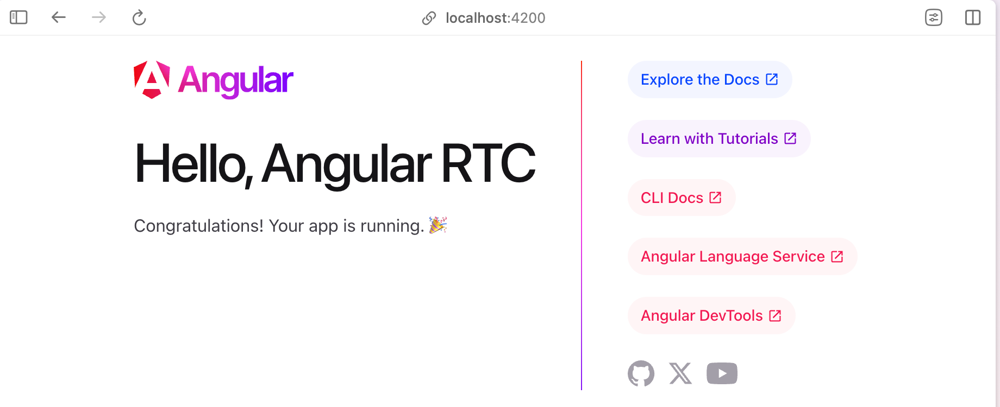
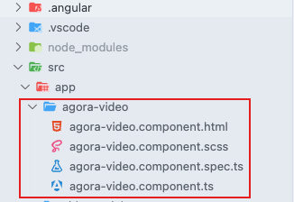
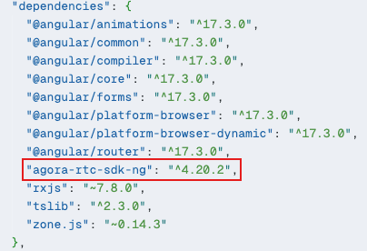
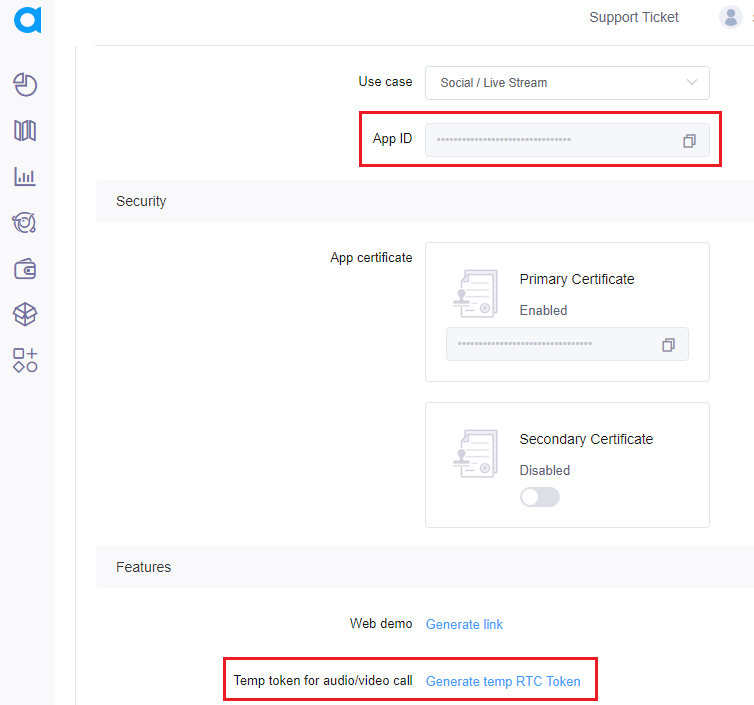
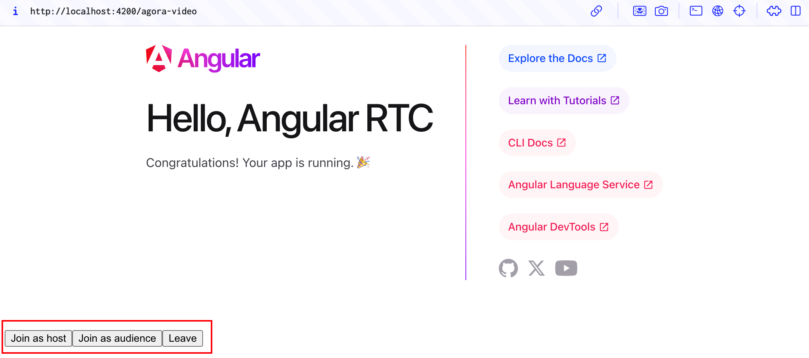
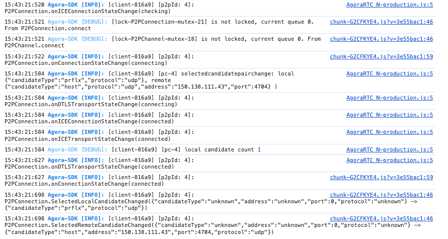

# Simple 3-step integration of Agora Video SDK

1. **Install and Run Angular**

    1. Install [Node.js LTS](https://nodejs.org/en).

    1. Install [Angular CLI](https://angular.io/cli). 
        
        To install using `npm`, run the command `npm install -g @angular/cli`.

    1. To create a new project, execute `ng new my-app`. 
        
        Replace `my-app` with your project name.

    1. Navigate to the project directory using `cd ~/my-app`

    1. To start the local server, execute `ng serve`

    1. Open the URL [http://localhost:4200/](http://localhost:4200/) in your browser. You see the following screen:

        

    You have successfully installed Angular! 🎉


2. **Integrate Agora Video SDK**

    1. To create a component, run the command `ng generate component agora-video`. 
        
        You see the following directory:

        

    1. To install Agora Video SDK, execute `npm i agora-rtc-sdk-ng`

        

    1. Overwrite the contents in `agora-video.component.ts` with the following:

        ```ts
        import { Component } from "@angular/core";
        import AgoraRTC from "agora-rtc-sdk-ng";

        interface RTC {
          localAudioTrack: any;
          localVideoTrack: any;
          client: any;
        }

        @Component({
          selector: "app-agora-video",
          templateUrl: "./agora-video.component.html",
          styleUrls: ["./agora-video.component.scss"],
        })
        export class AgoraVideoComponent {
          rtc: RTC = {
            localAudioTrack: null,
            localVideoTrack: null,
            client: null,
          };

          options = {
            appId: "Copy APP ID here",
            channel: "",
            token: "Copy temporary token here",
            uid: 123456,
          };

          async startBasicLiveStreaming() {
            this.rtc.client = AgoraRTC.createClient({ mode: "live", codec: "vp8" });

            window.onload = async () => {
              const hostJoinButton = document.getElementById("host-join");
              const audienceJoinButton = document.getElementById("audience-join");
              const leaveButton = document.getElementById("leave");

              if (hostJoinButton) {
                hostJoinButton.onclick = async () => {
                  // Now you can use ClientRole from agora-rtc-sdk-ng
                  this.rtc.client.setClientRole("host");
                  await this.rtc.client.join(this.options.appId, this.options.channel, this.options.token, this.options.uid);
                  console.log("here");

                  this.rtc.localAudioTrack = await AgoraRTC.createMicrophoneAudioTrack();
                  this.rtc.localVideoTrack = await AgoraRTC.createCameraVideoTrack();
                  await this.rtc.client.publish([this.rtc.localAudioTrack, this.rtc.localVideoTrack]);

                  const localPlayerContainer = document.createElement("div");
                  localPlayerContainer.id = this.options.uid.toString();
                  localPlayerContainer.textContent = "Local user " + this.options.uid;
                  localPlayerContainer.style.width = "640px";
                  localPlayerContainer.style.height = "480px";
                  document.body.append(localPlayerContainer);

                  this.rtc.localVideoTrack.play(localPlayerContainer);

                  console.log("publish success!");
                };
              }

              if (audienceJoinButton) {
                audienceJoinButton.onclick = async () => {
                  this.rtc.client.setClientRole("audience");
                  await this.rtc.client.join(this.options.appId, this.options.channel, this.options.token, this.options.uid);

                  this.rtc.client.on("user-published", async (user: any, mediaType: string) => {
                    await this.rtc.client.subscribe(user, mediaType);
                    console.log("subscribe success");

                    if (mediaType === "video") {
                      const remoteVideoTrack = user.videoTrack;
                      const remotePlayerContainer = document.createElement("div");
                      remotePlayerContainer.id = user.uid.toString();
                      remotePlayerContainer.textContent = "Remote user " + user.uid.toString();
                      remotePlayerContainer.style.width = "640px";
                      remotePlayerContainer.style.height = "480px";
                      document.body.append(remotePlayerContainer);

                      remoteVideoTrack.play(remotePlayerContainer);
                    }

                    if (mediaType === "audio") {
                      const remoteAudioTrack = user.audioTrack;
                      remoteAudioTrack.play();
                    }
                  });

                  this.rtc.client.on("user-unpublished", (user: any) => {
                    const remotePlayerContainer = document.getElementById(user.uid);
                    remotePlayerContainer && remotePlayerContainer.remove();
                  });
                };
              }

              if (leaveButton) {
                leaveButton.onclick = async () => {
                  this.rtc.localAudioTrack.close();
                  this.rtc.localVideoTrack.close();

                  this.rtc.client.remoteUsers.forEach((user: any) => {
                    const playerContainer = document.getElementById(user.uid);
                    playerContainer && playerContainer.remove();
                  });

                  await this.rtc.client.leave();
                };
              }
            };
          }

          constructor() {
            this.startBasicLiveStreaming();
          }
        }
        ```

    1. Overwrite the contents in `agora-video.component.html` with the following: 

        ```html
        <!-- agora-video.component.html -->
        <div>
        <button type="button" id="host-join">Join as host</button>
        <button type="button" id="audience-join">Join as audience</button>
        <button type="button" id="leave">Leave</button>
        </div>
        ```

    1. Overwrite the contents in `app.routes.ts` with the following:  

        ```ts
        import { Routes } from "@angular/router";
        import { AgoraVideoComponent } from "./agora-video/agora-video.component";

        export const routes: Routes = [{ path: "agora-video", component: AgoraVideoComponent }];
        ```

    You have successfully installed the Agora Video SDK! 🎉

1. **Create an Agora account**

    1. Register and log in to [Agora Console](https://console.agora.io).

    2. Navigate to the **Project Management** tab. Find your project and click **Configure**. Copy your APP ID, and generate a temporary Token.

        

    3. Open `agora-video.component.ts` and update the APP ID and token:

        ```ts
        options = {
          appId: "Copy here",
          channel: "agora-video",
          token: "Copy here",
          uid: 123456,
        };
        ```

## Test the code

1. Open the URL `http://localhost:4200/agora-video` in your browser.

    

1. Click the **Join as host** button to join the channel.

1. Open another browser window, click **Join as audience**, and join the same channel. In the Console, you see the following log, indicating that the test is successful. 

    

Congratulations! 🎉🎉🎉
You have successfully created your first Angular project with Agora Video SDK. 
