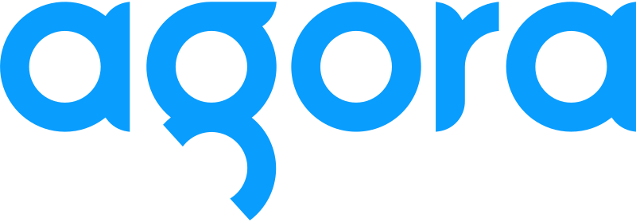

<div align="center">
  
  <!-- Agora  -->
  <p>
    <a href="https://www.agora.io/en/join-slack/"></a>
    <a href="https://www.agora.io/en"></a>
    <a href="https://www.agora.io/en/products/video-call/"></a>
    <a href="https://www.agora.io/en/products/chat/"></a>
  </p>
</div>

# RTC-Angular with Agora Live Video 

Typescript implmentation of the Agora Video SDK for Web v4.20 using the Angular framework

The [Guide.md](Guide.md) contains a walk-through of the project, including setup and code.

## Demo
Test the build: []()

## Setup

1. Clone the repo
1. Add [Agora API Key](#how-to-aquire-an-agora-appid) to the [`environments.ts`](src/environments/environments.ts) file

## Test in Dev mode
1. Follow steps in setup
1. Open the terminal and navigate to repo folder
1. Use this command to run dev mode with local webserver: 

   ```bash
   ng serve
   ```

### How to aquire an Agora AppID

1. Register and log in to [Agora Console](https://console.agora.io).

1. Navigate to the **Project Management** tab. 

1. Find your project and click **Configure**. 

1. Copy your APP ID, 

1. Scroll down and generate a temporary Token (if security is enable).

