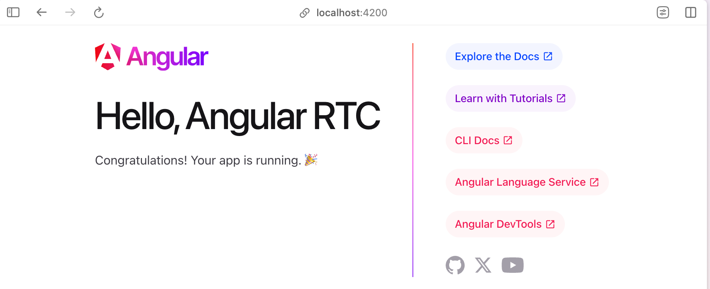
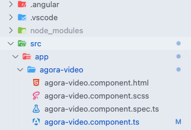
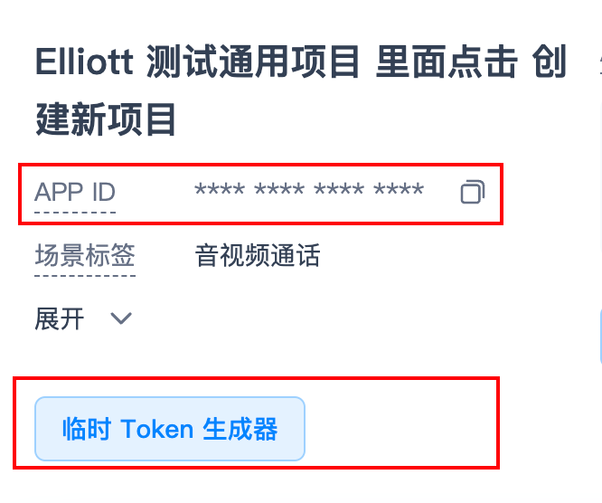

从 0 到 1 把声网 RTC 集成到最新的 Angular 项目中。

## 1. 安装并跑起 Angular

> [!NOTE]
> 图片看上去有点奇怪，得想个办法美化一下。

1.1 安装 [ Node.js LTS ](https://nodejs.org/en)

1.2 安装 [ Angular CLI ](https://angular.io/cli) 或者直接跑命令 `npm install -g @angular/cli`

1.3 本地创建项目 `ng new my-app（项目名称）`

1.4 到项目目录 `cd ~/my-app`

1.5 本地开跑 `ng serve`

1.6 打开浏览器 URL `http://localhost:4200/`, 现在看到的画面应该如下：



1.7 第 1 步完成！

<br>
<hr>
<br>
<br>

## 2. 加入 RTC SDK

2.1 安装 `npm i agora-rtc-sdk-ng`

2.2 创建组件 `ng generate component agora-video` 后会看到如下目录：



2.3 复制如下代码覆盖 `agora-video.component.ts` 后看到：

```ts
import { Component } from "@angular/core";
import AgoraRTC from "agora-rtc-sdk-ng";

interface RTC {
  localAudioTrack: any;
  localVideoTrack: any;
  client: any;
}

@Component({
  selector: "app-agora-video",
  templateUrl: "./agora-video.component.html",
  styleUrls: ["./agora-video.component.scss"],
})
export class AgoraVideoComponent {
  rtc: RTC = {
    localAudioTrack: null,
    localVideoTrack: null,
    client: null,
  };

  options = {
    appId: "eb6b8be7752c44c0b3c9a0b7602ffdf3",
    channel: "elliott-test",
    token: "007eJxTYPC+fqb8tvWH09kLutr+8PXWtpgXXa2IPdz47cWR6xcftK1SYEhNMkuySEo1Nzc1SjYxSTZIMk62TDRIMjczMEpLS0kzdnKWT2sIZGR4/3YKIyMDBIL4PAyuOTmZ+SUlugU5iZUMDADnEidX",
    uid: 123456,
  };

  async startBasicLiveStreaming() {
    this.rtc.client = AgoraRTC.createClient({ mode: "live", codec: "vp8" });

    window.onload = async () => {
      const hostJoinButton = document.getElementById("host-join");
      const audienceJoinButton = document.getElementById("audience-join");
      const leaveButton = document.getElementById("leave");

      if (hostJoinButton) {
        hostJoinButton.onclick = async () => {
          // Now you can use ClientRole from agora-rtc-sdk-ng
          this.rtc.client.setClientRole("host");
          await this.rtc.client.join(this.options.appId, this.options.channel, this.options.token, this.options.uid);
          console.log("here");

          this.rtc.localAudioTrack = await AgoraRTC.createMicrophoneAudioTrack();
          this.rtc.localVideoTrack = await AgoraRTC.createCameraVideoTrack();
          await this.rtc.client.publish([this.rtc.localAudioTrack, this.rtc.localVideoTrack]);

          const localPlayerContainer = document.createElement("div");
          localPlayerContainer.id = this.options.uid.toString();
          localPlayerContainer.textContent = "Local user " + this.options.uid;
          localPlayerContainer.style.width = "640px";
          localPlayerContainer.style.height = "480px";
          document.body.append(localPlayerContainer);

          this.rtc.localVideoTrack.play(localPlayerContainer);

          console.log("publish success!");
        };
      }

      if (audienceJoinButton) {
        audienceJoinButton.onclick = async () => {
          this.rtc.client.setClientRole("audience");
          await this.rtc.client.join(this.options.appId, this.options.channel, this.options.token, this.options.uid);

          this.rtc.client.on("user-published", async (user: any, mediaType: string) => {
            await this.rtc.client.subscribe(user, mediaType);
            console.log("subscribe success");

            if (mediaType === "video") {
              const remoteVideoTrack = user.videoTrack;
              const remotePlayerContainer = document.createElement("div");
              remotePlayerContainer.id = user.uid.toString();
              remotePlayerContainer.textContent = "Remote user " + user.uid.toString();
              remotePlayerContainer.style.width = "640px";
              remotePlayerContainer.style.height = "480px";
              document.body.append(remotePlayerContainer);

              remoteVideoTrack.play(remotePlayerContainer);
            }

            if (mediaType === "audio") {
              const remoteAudioTrack = user.audioTrack;
              remoteAudioTrack.play();
            }
          });

          this.rtc.client.on("user-unpublished", (user: any) => {
            const remotePlayerContainer = document.getElementById(user.uid);
            remotePlayerContainer && remotePlayerContainer.remove();
          });
        };
      }

      if (leaveButton) {
        leaveButton.onclick = async () => {
          this.rtc.localAudioTrack.close();
          this.rtc.localVideoTrack.close();

          this.rtc.client.remoteUsers.forEach((user: any) => {
            const playerContainer = document.getElementById(user.uid);
            playerContainer && playerContainer.remove();
          });

          await this.rtc.client.leave();
        };
      }
    };
  }

  constructor() {
    this.startBasicLiveStreaming();
  }
}
```

2.4 复制如下代码覆盖 `agora-video.component.html` 后：

```html
<!-- agora-video.component.html -->
<div>
  <button type="button" id="host-join">Join as host</button>
  <button type="button" id="audience-join">Join as audience</button>
  <button type="button" id="leave">Leave</button>
</div>
```

2.5 第 2 步完成

<br>
<hr>
<br>
<br>

## 3. 创建声网账号

3.1 console.shengwang.cn 注册并登录。

3.2 如下图所示， 实名认证后， 拷贝 APP ID 并生成临时 Token



3.3 复制 APP ID 和 Token 到 `agora-video.component.ts` 中：

```ts
options = {
  appId: "复制到这里",
  channel: "agora-video",
  token: "复制到这里",
  uid: 123456,
};
```

3.4 第 3 步完成
